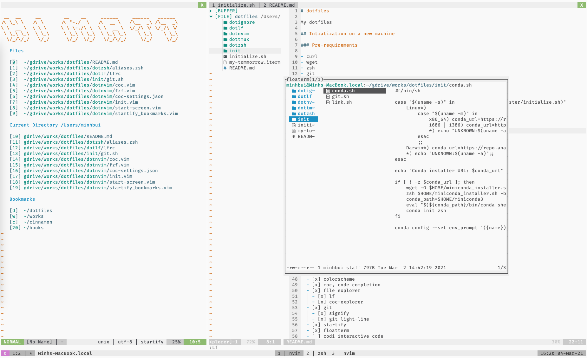

# dotfiles

My dotfiles

<p align="center">
  
</p>

## Intialization on a new machine

### Pre-requirements

- curl
- wget
- zsh
- git

### Magic command

```sh
sh -c "$(curl -fsSL https://raw.githubusercontent.com/mattbui/dotfiles/master/initialize.sh)"
```

## TODO

- [x] init:
  - [x] configs:
    - [x] zsh
    - [x] git
    - [x] nvim
    - [x] tmux
    - [x] fzf
    - [x] lf
  - [ ] setup scripts (support for homebrew, apt, apk):
    - [ ] zsh
    - [ ] git
    - [ ] nvim
    - [ ] tmux
    - [ ] fzf
    - [ ] lf
    - [x] conda
- [x] zsh:
  - [x] antigen plugins manager
  - [x] auto-complete
  - [x] syntax highlight
  - [x] vim mode
  - [x] manpage
- [x] nvim:
  - [x] basic settings
  - [x] basic key-maps
  - [x] plugins manager
  - [x] colorscheme
  - [x] coc, code completion
  - [x] file explorer
    - [x] lf
    - [x] coc-explorer
  - [x] git
    - [x] signify
    - [x] git light-line
  - [x] startify
  - [x] floatterm
  - [ ] codi interactive code
  - [x] fzf integration
- [x] tmux:
  - [x] vim-like navigation
  - [x] vim-like copy-mode
  - [x] tmux-line
- [x] fzf: basic configs
  - [ ] open directory/file (fo)
  - [ ] open file in vim (fe)
- [x] lf: basic configs
  - [x] icons: nerd fonts
  - [x] lfcd: map to ctr+o
  - [x] trash
  - [x] addDir, addFile
