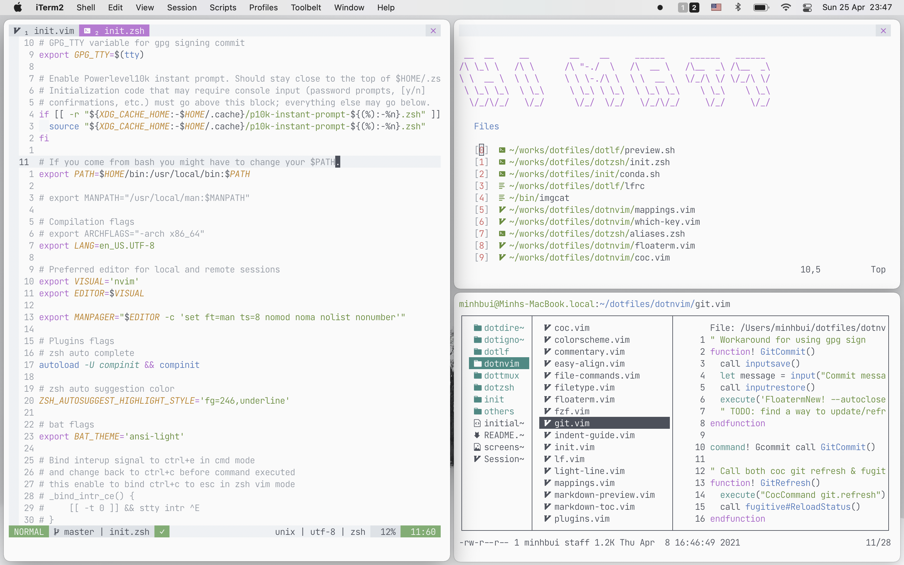

# dotfiles

My dotfiles

<p align="center">
  
</p>

Contents:

<!-- Table of contents GFM -->

* [Intialization on a new machine](#intialization-on-a-new-machine)
  - [Pre-requirements](#pre-requirements)
  - [Magic command](#magic-command)
* [TODO/Features](#todofeatures)

<!-- Table of contents -->

## Intialization on a new machine

### Pre-requirements

- curl
- wget
- zsh
- git

### Magic command

```sh
sh -c "$(curl -fsSL https://raw.githubusercontent.com/mattbui/dotfiles/master/initialize.sh)"
```

## TODO/Features

- [x] init:
  - [x] configs:
    - [x] zsh
    - [x] git
    - [x] nvim
    - [x] tmux
    - [x] fzf
    - [x] lf
    - [x] direnv
  - [ ] setup scripts (support for homebrew, apt, apk, without package manager):
    - [ ] zsh
    - [ ] git
    - [ ] nvim
    - [ ] tmux
    - [ ] fzf
    - [ ] lf
    - [ ] fd
    - [x] conda
    - [ ] direnv
- [x] zsh:
  - [x] antigen plugins manager
  - [x] auto-complete
  - [x] syntax highlight
  - [x] vim mode
  - [x] manpage
- [x] nvim:
  - [x] basic settings
  - [x] basic key-maps
  - [x] plugins manager
  - [x] colorscheme
  - [x] coc, code completion
  - [x] file explorer
    - [x] lf
    - [x] coc-explorer
  - [x] git:
    - [x] fugitive
    - [x] coc-git
  - [x] startify
  - [x] floatterm
  - [ ] jupyter integration
    - [ ] [jupyter-vim](https://github.com/jupyter-vim/jupyter-vim) (send code to jupyter kernal)
    - [ ] [vim-ipynb](https://github.com/anosillus/vim-ipynb) (edit code in ipynb files)
  - [x] fzf integration
- [x] tmux:
  - [x] vim-like navigation
  - [x] vim-like copy-mode
  - [x] tmux-line
- [x] fzf: basic configs
  - [x] use fd as default command
  - [x] open file (fo)
  - [x] change directory (fcd)
  - [x] alias finder with fzf (fa)
  - [x] ctrl+f to change directory with fzf
- [x] lf: basic configs
  - [x] icons: nerd fonts
  - [x] lfcd: map to ctr+o
  - [x] trash
  - [x] addDir, addFile
  - [x] openWithEditor
- [ ] things to try??
